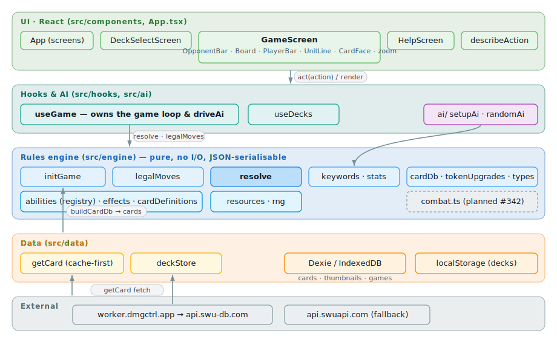
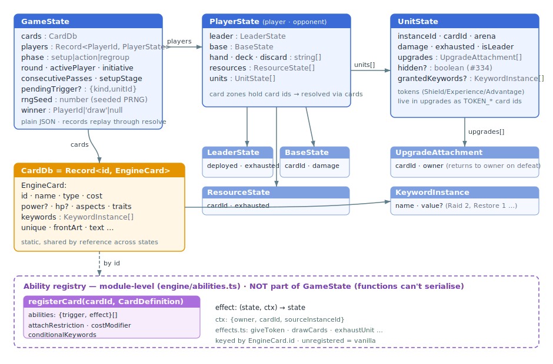
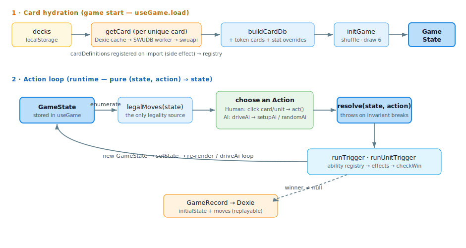

# Sealed — Architecture

Standalone desktop web app for playing SWU Sealed against an AI opponent. Lives at
`dmgctrl.app/sealed` (Vite `base: '/sealed/'`), deliberately separate from the dmgCtrl PWA.
Build plan and epic breakdown: `docs/swu-ai-handoff.html` (repo root).

## Components &amp; integration

Four layers, each depending only on the one below: **UI** (React) → **hooks &amp; AI** →
a **pure rules engine** → **data/network**. The engine does no I/O and is fully
JSON-serialisable; everything above calls into it and re-renders on the returned
state. Card abilities live in a **module-level registry** beside the engine, keyed by
card id, so `GameState` stays pure data.

## The rules engine

The heart of the app is a pure function pair:

- **`legalMoves(state): Action[]`** — the *single source of legality*. Everything the
  active player may do, fully enumerated. The aspect-penalty cost calculation
  (CR 8.1, multiset icon matching) lives here as `effectiveCost`.
- **`resolve(state, action): GameState`** — applies an action produced by the
  generator. Throws on engine-invariant violations (wrong phase, unknown ids,
  game over) but does not re-validate game rules.

Supporting modules: `types.ts` (schema), `cardDb.ts` (SWUDB payload → normalised
static card data), `initGame.ts` (setup per CR §5.2: shuffle, draw 6 — the game opens in a SETUP
phase with two stages resolved through legalMoves/resolve: mulligan decisions
(CR 5.2.1e, initiative holder first), then each player picks which 2 hand
cards become starting resources (CR 5.2.1f; all pairs enumerated as actions).
The AI's setup choices come from `ai/setupAi.ts` — keep only with a turn-1
play, resource to preserve the early curve),
`resources.ts` (cost payment/readying).

Design properties that matter for later epics:

- **States are plain JSON.** `GameState` round-trips through `JSON.stringify`; the
  static card db hangs off the state but is shared *by reference* between successive
  states, so cloning is cheap for tree search (E5 MCTS).
- **Determinism is injectable and serialisable.** The initial shuffle and AI rng are
  injectable parameters; in-game randomness (mulligan reshuffles) draws from a seeded
  PRNG whose seed lives ON GameState (`rngSeed`, advanced per use) — so records replay
  bit-identically.
- **Replayability.** A `GameRecord` stores the initial state plus every action;
  replaying them through `resolve` reproduces the game exactly (E7 training data).

Rules verified against the full Comprehensive Rules v7.0: setup (§5.2 incl.
mulligan), action phase/initiative (§1.15, §5.4), regroup (§5.5), attack timing
(§6.3), empty deck (§8.6), Sealed deckbuilding (§10.2). `checkWin` evaluates both
bases so a single action that defeats both is a **draw** (`winner: 'draw'`, §5.6.3).

**Card behaviour** (epic #302): the ability framework (#303,
`engine/abilities.ts` + `docs/ability-framework.md`) registers per-card effects
by id — unregistered cards play vanilla. Keywords (#305) are data-driven from
SWUDB `Keywords[]` (numerals extracted from rules text): Sentinel and Saboteur
shape legal attack targets; Raid/Grit flow through `effectivePower`, Overwhelm
and Restore hook combat in the resolver. Combat and defeat checks go through
`engine/stats.ts` (`effectivePower`/`effectiveHp`) so upgrades (#308) and
lasting effects (#306) slot into one pipeline. **Still pending**: unit/leader
abilities, events, upgrades (#306–#309), Ambush (#306), Shielded (#308),
concession.

## Data model

`GameState` is plain JSON — it round-trips through `JSON.stringify`, so a `GameRecord`
(initial state + every action) replays bit-identically through `resolve`. The static
card database (`cards: CardDb`) hangs off the state but is **shared by reference**
between successive states, keeping cloning cheap for future tree search. Card zones
(`hand`/`deck`/`discard`) hold card **ids**, resolved against `cards`. Token upgrades
(Shield/Experience/Advantage) live inside `UnitState.upgrades` as `TOKEN_*` card ids.
Ability code can't live on the state (functions don't serialise), so it sits in the
module-level **ability registry** — `registerCard(cardId, …)` — consulted by the engine.

## Game flow at runtime

`useGame` owns the loop:

1. Hydrate every unique card in both decks (`getCard` — cache-first, network fallback).
2. `buildCardDb` → `initGame` → store state; snapshot the initial state for the record.
3. Human acts via the action-menu buttons → `resolve`.
4. `driveAi` loop: while the AI is active and the game is live, `randomAi` picks from
   `legalMoves`, resolves, and logs — through action *and* regroup phases (capped at
   500 steps as a hang guard).
5. When `winner` is set, the game record persists once to IndexedDB.

`useGame` reads live state from a ref inside `act` (not a setState updater) so that
under React `StrictMode` — which double-invokes updaters in dev — each action logs
and drives the AI exactly once.

## UI (GameScreen)

The board is drawn with art-dominant cards, not text rows:

- **`CardFace`** renders a card *as its art*, filling a fixed **square slot** (side =
  the card's long edge) so cards never overlap regardless of orientation. Orientation
  follows the rules: units are portrait (landscape when exhausted); bases and undeployed
  leaders are landscape; a deployed leader shows its unit (back) side, portrait. Missing
  or failed art falls back to a text summary (cost/name/power-HP/keywords/abilities).
  Sizing constants live in `cardSizing.ts`; the roll-over zoom (#321) drives its `widthPx`.
  Selection/target/actionable highlights are a 2px outline hugging the card edge (1px in /
  1px out, `outline-offset: -1px`) via the `highlight` prop. Unit effects are drawn as
  physical-style **tokens** (`tokens.ts` — `tokenLayout` places 1–4 over the middle of the
  art: a 2×2 build-up when ready, a centred row when exhausted, keeping the cost/name,
  ability text and power/HP visible) on the non-rotating wrapper, so they stay upright when
  the card is exhausted. Damage is the first token — a deep-red rounded rectangle with a
  white number (two digits fit); more effect types slot into the same layout (#326).
- **Roll-over zoom** (`useCardZoom` + `CardZoomPopover`, #321): **Shift+hover** (mouse, so plain
  hovering doesn't obscure play) or **touch-long-press** shows a full-size, upright
  copy floating above the board (absolute, centred on the source; viewport-edge clamping is the
  follow-up #331). Long-press suppresses the click so it doesn't also play/attack; holding **Alt**
  flips a dual-sided leader's face. Shift/Alt come from a shared `useModifierKeys` store (one set
  of listeners, not one per card). The zoom scale is `ZOOM_WIDTH_PX` (cardSizing.ts) — one place.
- **Screen layout** (#332): the game screen is full-bleed — a two-column grid
  (`16rem 1fr`), no divider between them. Backgrounds follow one rule: the **play area,
  the bars and the two headers use the core theme background** (transparent → the body
  starfield), while the **log and the individual pile columns use `bg-surface`**. So the
  **left column** header (the transparent **dmgCtrl icon = exit** with the **dmgCtrl**
  wordmark, and the **? = help** aligned to the log's right edge) sits on the starfield
  like the page header, above the **log** — a `bg-surface` panel filling the height. The
  **right column** is the **play area**, edge-to-edge to the top and right and transparent,
  so the opponent leader reads as joined with it. The frame (icon/help/log) renders even
  while cards load or a load fails, so leaving/Help are always available.
- **Bars** — a **bar** is a player's off-battlefield row of piles. Convention:
  - **Player bar** (`PlayerBar`): Deck | Resources | Hand | Action | Discard. The **hand
    flexes** to fill the width (the most important area); the **action** column is a fixed
    width so its buttons don't shift the layout between phases. Small columns are `auto`.
  - **Opponent bar** (`OpponentBar`): a `1fr auto 1fr` grid — discard + hand on the left,
    **their leader centred** (so it lines up with the bases and the player leader below),
    resources + deck on the right. The opponent leader lives here, not on the battlefield.
  - Each pile sits in a `BarColumn`: a `bg-surface` column (the same background as the log)
    with an accent all-caps label rotated 90° anticlockwise on its left. The opponent leader
    has no column — it sits directly on the transparent play area, joined with the board.
- **Battlefield layout** (`Board`): a three-column grid — **Space | Leaders+Bases | Ground** —
  set with an inline `grid-template-columns` (Tailwind can't compile a `minmax(0,1fr)`
  arbitrary value). It's transparent and grows to fill the play area's height, centring the
  board vertically. The opponent half is bottom-anchored and your half top-anchored, so
  the two bases meet at the **battlefront** in the centre and units line up along it,
  stacking away as more are played. `boardLayout.orderUnits` keeps Sentinels at the front.
  Each base shows the **damage it has taken** — counting up to the card's HP (dynamic,
  never a hardcoded 30) — as a large number overlaid on the card (PWA game-screen style:
  light weight, accent glow, ~50% of card height). Counting remaining down instead is a
  future display preference (#324); it never touches game state or logs.

## Storage tiers

| Store | Holds | Why |
|---|---|---|
| localStorage `sealed_decks` | Imported decks | Tiny, synchronous |
| IndexedDB `cards` ← `setImport.ts` | Whole sets via one SWUDB search call (`?q=set:XXX`) | Full catalogue offline; includes bases the detail endpoint 502s on (#310) |
| IndexedDB `cards` (Dexie v1) | Card JSON + thumbnail bytes | ~KBs per card; queryable; offline |
| IndexedDB `games` (Dexie v2) | Completed game records | Replayable substrate for E7 training |

Thumbnails are stored as `ArrayBuffer + mime` rather than Blob — ArrayBuffers
structured-clone reliably in every IndexedDB implementation; Blobs do not (and
jsdom/fake-indexeddb can't round-trip them in tests either).

SQLite/Drizzle (from the original plan) is deferred to E7, whose training pipeline
is its actual consumer. `docker-compose.yml` holds commented placeholders for the
E5–E7 services (redis, influxdb, grafana, ollama).

## Network

`api.swu-db.com` serves no CORS headers, so the browser cannot fetch it directly.
All card-detail requests route through the existing Cloudflare worker
(`worker.dmgctrl.app`) whose fallback route proxies any path to api.swu-db.com and
adds `Access-Control-Allow-Origin: *` (see `proxy/worker.js`). Card art on
`cdn.swu-db.com` has the same CORS gap — the worker's `/art/<path>` route (#311)
streams those images through with CORS and a long cache lifetime; the client-side
`artUrl()` helper (`data/thumbnails.ts`) rewrites cdn.swu-db.com URLs onto it and
leaves CORS-friendly hosts (cdn.starwarsunlimited.com) untouched.

## Testing

Strict TDD; ~285 tests at the time of writing. Engine tests use hand-built fixture
states (`src/test/helpers/engineFixtures.ts`); data-layer tests run against
fake-indexeddb; screen tests drive the real hook + engine with seeded caches,
deterministic shuffles, and a "passive" AI rng (near-1 → always picks pass, the
last-ordered legal move). `npm test` at the repo root runs main + proxy + sealed.
