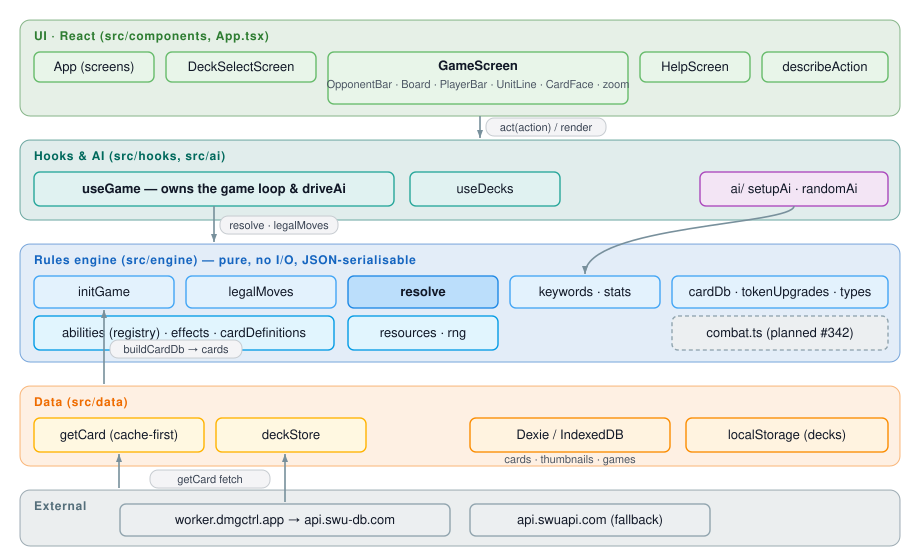
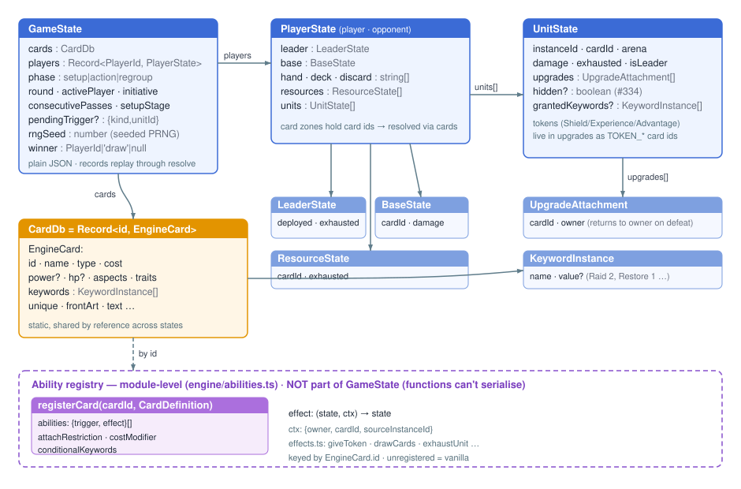
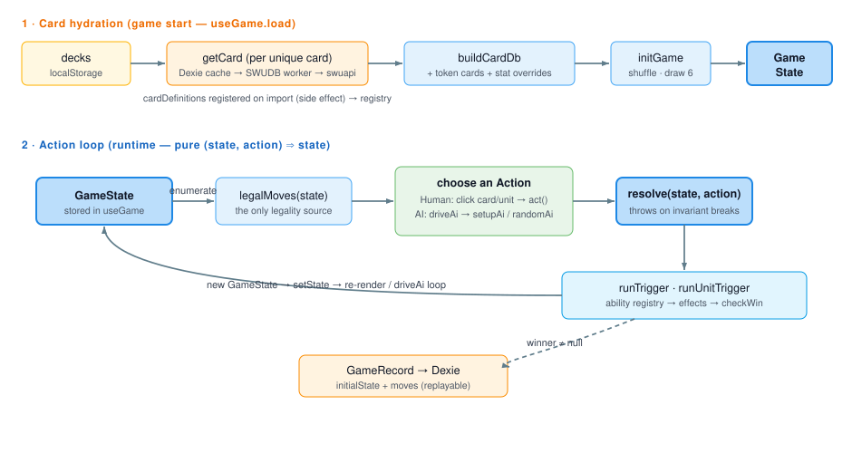

# Sealed: Architecture

Standalone desktop web app for playing SWU Sealed against an AI opponent. Lives at
`dmgctrl.app/sealed` (Vite `base: '/sealed/'`), deliberately separate from the dmgCtrl PWA.
Build plan and epic breakdown: `docs/swu-ai-handoff.html` (repo root).

## Desktop browser only

**Sealed targets a desktop browser and nothing else.** It renders and plays on a phone, but the
layout needs more screen than a phone has, so the experience is poor. Adapting it is a redesign
rather than a set of breakpoints, and it is not currently planned.

Two consequences worth knowing before optimising anything:

- **The AI's compute budget is generous.** A desktop CPU absorbs a search that a mid-range phone
  would not, so per-decision cost is measured against a budget of hundreds of milliseconds rather
  than tens. A Web Worker, which exists to keep a phone's UI responsive under a blocking search, is
  therefore not a prerequisite for shipping a deeper model here.
- **This is not part of the PWA.** The PWA (X-Wing, SWU tracking, Kill Team) is mobile-first and
  lives at the site root; Sealed only borrows its dev server and origin. See
  [operations.md](operations.md) for how the two interact.

## Components &amp; integration

Four layers, each depending only on the one below: **UI** (React) → **hooks &amp; AI** →
a **pure rules engine** → **data/network**. The engine does no I/O and is fully
JSON-serialisable; everything above calls into it and re-renders on the returned
state. Card abilities live in a **module-level registry** beside the engine, keyed by
card id, so `GameState` stays pure data.

## The rules engine

The heart of the app is a pure function pair:

- **`legalMoves(state): Action[]`**: the *single source of legality*. Everything the
  active player may do, fully enumerated. The aspect-penalty cost calculation
  (CR 8.1, multiset icon matching) lives here as `effectiveCost`.
- **`resolve(state, action): GameState`**: applies an action produced by the
  generator. Throws on engine-invariant violations (wrong phase, unknown ids,
  game over) but does not re-validate game rules.

Supporting modules: `types.ts` (schema), `cardDb.ts` (SWUDB payload → normalised
static card data; two small data-patch tables feed in here: `upgradeStatOverrides.ts` *fills* the
Power/HP the ASH upgrade data omits, and `cardDataCorrections.ts` *overrides* values the source
gets wrong, read off the printed card (e.g. Moff Gideon unit cost, Nebulon-C Frigate arena); both
drop out per-card once upstream is fixed), `initGame.ts` (setup per CR §5.2: shuffle, draw 6. The game opens in a SETUP
phase with two stages resolved through legalMoves/resolve: mulligan decisions
(CR 5.2.1e, initiative holder first), then each player picks which 2 hand
cards become starting resources (CR 5.2.1f; all pairs enumerated as actions).
The AI's setup choices come from `ai/setupAi.ts`: keep only with a turn-1
play, resource to preserve the early curve),
`resources.ts` (cost payment/readying).

Design properties that matter for later epics:

- **States are plain JSON.** `GameState` round-trips through `JSON.stringify`; the
  static card db hangs off the state but is shared *by reference* between successive
  states, so cloning is cheap for tree search (E5 MCTS).
- **Determinism is serialisable, and the AI is part of it.** The initial shuffle is an
  injectable parameter; everything after it draws from a seeded PRNG whose seed lives ON
  GameState (`rngSeed`). `resolve` advances that seed **once per action**, whether or not
  the action consumed randomness, so the seed is a function of the action sequence alone.
  `randomAi(state)` draws its pick from that seed, making **the AI's move a pure function of
  the state**: the same position always draws the same reply, while any different line of play
  carries a different seed and is free to diverge. Opponents are swappable via
  `UseGameOptions.ai` (tests inject a passive one; smarter rungs slot in the same way), and are
  addressed by name through the registry in `ai/registry.ts`. The **deployed** opponent is a single
  config constant, `OPPONENT_AI` in `src/config.ts` (currently `greedy`): shipping a new model is a
  one-line change plus a redeploy, deliberately a reviewed deployment setting rather than a user
  choice.
- **Measurability.** Because the AI is pure and seeded, a headless harness can play thousands of
  games between two named AIs and report reproducible win rates. That harness (`src/bench/`, run with
  `npm run bench`) is the yardstick for the AI series; see [ai-benchmark.md](ai-benchmark.md).
- **Replayability.** A `GameRecord` stores the initial state plus every action;
  replaying them through `resolve` reproduces the game exactly (E7 training data). This holds
  only because the AI is state-seeded: an AI drawing from `Math.random` would make every
  saved record diverge on replay.

Rules verified against the full Comprehensive Rules v7.0: setup (§5.2 incl.
mulligan), action phase/initiative (§1.15, §5.4), regroup (§5.5), attack timing
(§6.3), empty deck (§8.6), Sealed deckbuilding (§10.2). `checkWin` evaluates both
bases so a single action that defeats both is a **draw** (`winner: 'draw'`, §5.6.3).

**Card behaviour**: the ability framework (`engine/abilities.ts`, see
[abilities.md](abilities.md)) registers per-card effects by id, and unregistered cards play vanilla. A `CardDefinition` carries **triggered abilities**
(fired at `whenPlayed` / `onAttackEnd` / `whenDefeated` / `whenReadies` / `onDefense` /
`whenRegroupStarts`), **activated `actionAbilities`**, and **static hooks**
(`attachRestriction`, `costModifier`, `conditionalKeywords`, `statModifier`,
`damageMultiplier`, `negatesOverwhelm`, `grantedTraits`, `makesLeaderUnit`,
`providesAspects`, `searchModifier`). Keywords are data-driven from SWUDB
`Keywords[]`: Sentinel/Saboteur/Hidden shape legal attack targets; Raid/Grit flow
through `effectivePower`; Overwhelm/Restore/Shielded/Ambush/Support hook play and
combat in the resolver. Combat and defeat go through `engine/stats.ts`
(`effectivePower`/`effectiveHp`) and **`engine/combat.ts`** (`applyUnitDamage` /
`dealDamageToUnit`, extracted so abilities can deal damage without a resolver cycle).
Upgrades attach into `unit.upgrades`; a card upgrade routes to its **owner's**
discard on defeat; token upgrades (Shield/Experience/Advantage) and token units live
there too. Optional "may…" decisions resolve through a **pending-choice queue** (`pendingChoices`),
including a mid-combat suspend/resume (`pendingAttack`) for On Defense. Simultaneous **abilities** are a
separate queue (`pendingTriggers`): every event collects what it triggered and resolves the batch one
ability at a time, so their controller orders them and each finishes before the next begins. All 25 ASH
upgrades are implemented. Every ASH leader (both sides) is implemented too. **Still pending**: events,
ability text on ordinary unit cards beyond keywords, and concession.

## Card identity and printings

A card is printed several ways (Normal, Hyperspace, foil, prestige tiers, showcase and more), each
with its **own collector number**, and ProtectThePod exports the printing you actually own. Since
everything the engine keys by card id is written against the Normal number (the ability registry,
`cardDataCorrections`, `upgradeStatOverrides`, the unique rule), a non-Normal printing was
unregistered and played as a vanilla body with no ability at all.

`data/printings.ts` **canonicalises the id during hydration**, before the engine sees anything:
`useGame` rewrites both the fetched cards and the deck lists onto the Normal ids. The engine
therefore never learns that printings exist, and no id-keyed table needs to know either. The
printing's own **art rides along**, so you still see the card you own.

- The join is `Type|Name|Subtitle`, because the set listing returns Normal printings only and so
  cannot be joined on number. Type matters: 13 unit names collide with leader names. Verified
  unambiguous for the whole ASH printing list, not just its Normal rows (925 rows, 264 distinct
  keys, every one of the 661 variants joins to exactly one Normal row).
- **Two tiers.** A bundled static map (`data/bundledPrintings.ts` + `data/printingMaps/*.json`,
  generated by `scripts/generatePrintingMap.mjs <SET>` from the set's full printing listing,
  `/cards/<SET>` with no query) is checked first and resolves synchronously, no IndexedDB or
  network involved. Anything not bundled (another set, or a printing released since the map was
  last generated) falls to the dynamic path: the cached set, then one `?q=set:XXX` call.
  The dynamic path has a failure mode worth knowing: `indexFromCache` returns a `Map` as soon as ANY
  Normal card for the set is cached, even an incomplete one, so an incomplete cache silently
  prevents the correct, complete network fetch from ever running. The bundled tier removes that race
  for anything it covers; re-run the generator when a new set gets ability support or FFG ships a
  new print run.
- **A card printed in more than one set is one card too.** Both joins above work within a set, and
  a reprint is a Normal printing of its own, so neither can reach across: `SEC_258` Grassroots
  Resistance resolved to itself and played as a blank event. `data/reprints.ts` declares those
  cards, naming the id whose behaviour the engine implements and the other sets' Normal ids, and is
  applied last, after the within-set id is known. Extending it is one line per card; variant
  printings need no line of their own, since they reach their set's Normal id first.
  `npm run bench --prefix sealed -- --triage <SETS>` lists cards printed in more than one set and
  marks the ones the table does not yet collapse.
- **Unresolvable cards keep their own id and play vanilla**, which is the previous behaviour, so
  being offline degrades rather than breaks. They are reported through
  `GameValue.unresolvedPrintings`, shown above the log and included in bug reports: the symptom
  (an ability simply not happening) is otherwise indistinguishable from a broken implementation.
- Saved decks keep the printings you own; only play is canonical. Two printings of one card in a
  deck collapse to a single entry, correct for play and merely meaning one of the two arts shows.
- The implemented-cards panel counts Normal printings, so its totals describe the set, not any
  particular pool.

## Data model

`GameState` is plain JSON: it round-trips through `JSON.stringify`, so a `GameRecord`
(initial state + every action) replays bit-identically through `resolve`. The static
card database (`cards: CardDb`) hangs off the state but is **shared by reference**
between successive states, keeping cloning cheap for future tree search. Card zones
(`hand`/`deck`/`discard`) hold card **ids**, resolved against `cards`. An
`UpgradeAttachment` (`{ cardId, owner }`) records who owns each attached upgrade so it
routes to the right discard on defeat; token upgrades (Shield/Experience/Advantage) and
token units (`TOKEN_*` ids) live in the card db as built-ins. Transient per-attack
grants (`grantedKeywords`, `grantedAbilityCardIds`), once-per-round ability usage
(`usedAbilities`), the **pending-choice queue** (`pendingChoices`), the **triggered-ability queue**
(`pendingTriggers`, with `triggerTurn` recording whose batch is resolving), a suspended-combat
record (`pendingAttack`), transient stat/keyword modifiers (`lastingEffects`, scoped to the phase or
to a single attack) and the
per-phase event log (`phaseEvents`) all live on the state, JSON-serialisable. Ability *code* can't
(functions don't serialise), so it sits in the module-level **ability registry**,
`registerCard(cardId, …)`, consulted by the engine.

## Game flow at runtime

`useGame` owns the loop:

1. Hydrate every unique card in both decks (`getCard`, cache-first, network fallback).
2. `buildCardDb` → `initGame` → store state; snapshot the initial state for the record.
3. Human acts by clicking cards/units, the action-menu buttons, or a pending-choice
   prompt (pay/play/discard, the "look at a card" / search overlays) → `resolve`.
4. `driveAi` loop: while the AI is active and the game is live, `randomAi` picks from
   `legalMoves`, resolves, and logs, through action *and* regroup phases (capped at
   500 steps as a hang guard).
5. When `winner` is set, the game record persists once to IndexedDB.

`useGame` reads live state from a ref inside `act` (not a setState updater) so that
under React `StrictMode`, which double-invokes updaters in dev, each action logs
and drives the AI exactly once.

**Undo** keeps a snapshot of the state, log length and move-list length taken before
**each individual action**, the AI's included. `undo()` rewinds to the last snapshot the human
took, which drops the AI's reply along with the player's move, and truncates the move list so
an undone move can never reach a saved record. Depth is unlimited: you can rewind to the
opening mulligan. Three deliberate constraints:

- **It is not an `Action`.** It lives on the hook's return value, so it cannot appear in
  `legalMoves` and the AI cannot pick it, which would otherwise loop forever.
- **It stops at the end of the game**, because the record has been written by then and
  rewinding past it would leave the saved game disagreeing with the screen.
- **The button is offered only when `allowUndo` is set**, which defaults to the build
  (`isDev()`). The gate is presentational, in `GameScreen`: the snapshots are kept either
  way, so turning the setting on mid-game exposes the whole history already recorded rather
  than starting from that moment.

Replaying an undone action reproduces the same AI reply, per the determinism contract above,
so undo cannot re-roll an outcome. It can still rewind past a mulligan, a draw or a search,
which lets the same decision be taken again with the hidden information already seen. That is
why it is off by default: it is a tool for pinning down a defect or practising a line, not part
of playing a game.

Because undone moves are truncated out, a game played with undo replays perfectly and is
otherwise indistinguishable from one played straight through. `useGame` therefore counts the
rewinds it performs and writes the total to the record's `undoCount`, so the E7 training
pipeline can tell a retried line from a played one. A rewind that found nothing to take back
does not count. The field is absent on records written before it existed, which means
provenance unknown rather than zero, and it cannot be backfilled.

The per-action granularity is finer than `undo` currently needs; it is the substrate for
stepping through history from the log.

## User settings

`data/settingsStore.ts` holds the shape, the defaults and the reading of the stored blob;
`hooks/useSettings.ts` wraps it in a context provider around the whole app. Consumers read
`settings` and call one `update(patch)`, so adding a setting is a field and an overlay row
with nothing to wire between them.

Four properties are load-bearing:

- **Defaults may depend on the build.** `allowUndo` and `showBugReport` default to `isDev()`:
  developer tools, on while developing and off in the shipped app, and a user preference
  either way. `defaultSettings()` is a function, not a constant, so the build is read at call
  time and both cases stay testable.
- **Reading never writes.** Persisting a computed default on first load would freeze one
  build's answer into storage and stop it tracking the build. Only an explicit change writes.
- **Every field is validated on load, against its own default.** A stored blob can be corrupt,
  partial or wrongly typed, and none of those may stop the app starting: an unusable value
  falls back to its default and the rest survives. A blob written before a setting existed
  omits it, which reads as that setting's default.
- **Settings are live.** They reach the UI through context, not through `UseGameOptions`, so a
  change applies to the game in progress rather than at the next game.

The surface is an **overlay** (`SettingsOverlay`), opened from the cog in the app header and
from the cog in the game header. Not a screen: routing away unmounts `GameScreen` and the game
with it, since the game lives entirely in `useGame`'s state and refs. `bugReportOverlay` and
`cardGridOverlay` are the same pattern. It reads the context directly rather than taking props,
unlike the presentational overlays, because a settings form has no caller-held state to be given.

The header chrome icons (bug, cog, question mark) live together in `components/icons.tsx` and
share one `ICON_PROPS` spec, so a mismatch between neighbours is visible in one file. The cog
and question mark are the PWA's paths, copied rather than imported: the two apps are separate
packages and deliberately stay that way.

## Help

`HelpOverlay` shows `userGuide.md`, and shows only the part belonging to the screen it was
opened from: importing and opponent choice on the deck screen, playing and the board in a game.

It is an overlay for the same reason settings is, and it is the reason that reason is known:
help used to be a screen, so opening it mid-game unmounted `GameScreen` and the game with it,
and coming back ran `initGame` again on a fresh seed. The overlay is held by `App` rather than
duplicated per screen, taking its context from `screen`, and renders over whichever screen is
mounted. Dismissed by Escape or a click outside the panel; there is no close button, so nothing
has to stay in view as the guide scrolls.

**The guide stays one file.** `utils/helpSections.ts` splits the rendered HTML into a preamble,
its `<h2>` sections and the trailing footer, and `HELP_SECTIONS` maps each section to a screen.
Splitting on `<h2>` only, so a section keeps its subsections. The preamble and the footer (the
fan-content disclaimer) go into every context. Per-screen files would have matched the PWA, at
the cost of a copy of the disclaimer in each and three files free to drift.

The cost of slicing one file is that the map is keyed on heading prose, so a renamed or newly
added section would silently vanish from the help rather than fail anything. `helpSections.test.ts`
closes that: the map must claim every section in the guide, and name no section the guide lacks.
**Adding a section to the user guide without assigning it to a screen fails the suite.**

Layout note: the **overlay** is the scroll container, not the panel. A panel capped at a
fraction of the viewport with the content scrolling inside it depends on a flex chain resolving
to a definite height, and that did not hold here: the game's help ran off the screen unreachably
while the deck screen's shorter help fitted and looked correct. `min-h-full` with `items-center`
centres a short panel and lets a tall one grow downward, so the top stays reachable.

## UI (GameScreen)

The board is drawn with art-dominant cards, not text rows:

- **`CardFace`** renders a card *as its art*, filling a fixed **square slot** (side =
  the card's long edge) so cards never overlap regardless of orientation. Orientation
  follows the rules: units are portrait (landscape when exhausted); bases and undeployed
  leaders are landscape; a deployed leader shows its unit (back) side, portrait. Missing
  or failed art falls back to a text summary (cost/name/power-HP/keywords/abilities).
  Sizing constants live in `cardSizing.ts`; the roll-over zoom drives its `widthPx`.
  Selection/target/actionable highlights are a 2px outline hugging the card edge (1px in /
  1px out, `outline-offset: -1px`) via the `highlight` prop. Unit effects are drawn as
  physical-style **tokens** (`tokens.ts`, where `tokenLayout` places 1 to 4 over the middle of the
  art: a 2×2 build-up when ready, a centred row when exhausted, keeping the cost/name,
  ability text and power/HP visible) on the non-rotating wrapper, so they stay upright when
  the card is exhausted. Damage is the first token: a deep-red rounded rectangle with a
  white number (two digits fit); more effect types slot into the same layout.
- **Roll-over zoom** (`useCardZoom` + `CardZoomPopover`): **Shift+hover** (mouse, so plain
  hovering doesn't obscure play) or **touch-long-press** shows a full-size, upright
  copy floating above the board (absolute, centred on the source; viewport-edge clamping is not yet
  implemented). Long-press suppresses the click so it doesn't also play/attack; holding **Alt**
  flips a dual-sided leader's face. Shift/Alt come from a shared `useModifierKeys` store (one set
  of listeners, not one per card). The zoom scale is `ZOOM_WIDTH_PX` (cardSizing.ts), one place.
  The popover portals to `document.body` and positions itself from the anchor element supplied by
  `setAnchor`. Two constraints keep that working, both learned from a production-only failure where every card but the board unit stayed invisible: `setAnchor` **must stay
  referentially stable**, since React detaches and re-attaches a callback ref whose identity
  changed, and refs attach bottom-up, so a popover rendered *inside* its anchor would otherwise
  measure a null ref; and a positioning pass that finds no anchor **falls back to centred, never
  hidden**. Dev hid the bug because StrictMode's dev-only double-invoke re-ran the layout effect
  after the ref attached. Assert zoom is *visible*, not merely mounted: presence alone passes
  while the popover is `visibility: hidden`.
- **Described actions and card references**: `describeAction` returns a flat string, which
  throws away *which* card each name refers to, and names are not unique (13 unit names collide
  with leader names), so recovering them by matching text would be wrong. `describeActionParts`
  therefore returns `DescribePart[]`: plain strings interleaved with `{cardId, controller, text}`
  tokens. `partsText(parts) === describeAction(…)` is an invariant pinned by test, which is what
  lets any un-converted branch fall back to a single plain string and simply render without
  references. `CardRef` renders a token bold and colour-coded (accent = you, amber = opponent),
  zooming on **plain hover**: the board's Shift gate exists so hovering the play area doesn't
  obscure it mid-play, which doesn't apply to a line of text. It is a ``, not an `<a>`:
  nothing navigates, so an anchor would mislead a screen reader. **Redacted entries never emit a
  token**, since an opponent's resource pick is hidden information (CR 1.17) and a card reference
  would leak it through the zoom regardless of the text saying "a card".
- **Action prompt**: `describeChoiceParts` says what the current board highlights are
  asking for, rendered between the two bases. It covers the `BOARD_TARGET_KINDS` choices, the
  ones resolved by clicking a highlighted card rather than a menu button, plus upgrade
  placement, which is local UI state rather than a pending choice. That constant is shared with
  the component's highlight logic so the two cannot drift. It also covers the steps that are
  *not* resolved on the board: the two **resourcing** steps (setup, and the regroup pick), where
  clicking a hand card is indistinguishable from playing one, and the **mulligan**, which is
  answered only from the Action column. Without a prompt a new player clicks their hand, gets
  no response, and has nothing on screen explaining why. It stays silent for the base actions
  (playing a card, choosing an attacker):
  those are self-evident, and a permanent prompt would train the player to ignore the panel.
  The prompt leads with the card that raised the choice. **Every** choice can name one: the
  ability dispatcher stamps `PendingChoice.source` automatically at the five places an effect is
  invoked, rather than it being passed at each of the ~185 `pushChoice` call sites, and follow-up
  choices inherit it from the choice being answered. `choiceSource.test.ts` plays the whole coverage
  deck set and fails if any choice reaches a player unattributed. The panel is **absolutely
  positioned and `pointer-events-none`**: in
  flow it reflowed the whole board every time it appeared or cleared, and being click-through
  lets it sit over the play area without stealing a click meant for a card. `CardRef` sets
  `pointer-events-auto` on itself so references inside it stay hoverable. Its fill uses
  `--color-surface-solid`, not `--color-surface`: the latter is itself `rgba(…, 0.45)`, so card
  art reads through it however it is applied.
- **Bug report**: the header's bug button opens a title/description form; submitting copies
  the assembled markdown to the clipboard and opens GitHub's prefilled new-issue page. Report
  assembly is pure (`utils/bugReport.ts`) and so is unit-tested; the hook exposes `replayData()`,
  a function rather than a value so nothing re-renders as the game runs.
  The report carries `initialState` + the move list, which **re-resolve to the exact game** thanks
  to the state-seeded AI, making every report a runnable fixture. The card DB is stripped: it is
  ~12KB of a ~13KB state and rebuilds from the deck lists.
  **Why clipboard rather than a one-click API call:** the app is static with no backend, so filing
  directly would need a token. Going through GitHub's own page means the issue is authored by
  whoever is signed in there (correct attribution, no secret in the bundle), and the clipboard
  carries the payload because the replay data is ~17KB against a ~8KB URL ceiling. A refused
  clipboard keeps the form open with the text shown rather than opening a half-filed issue.
  The issue body is prefilled **empty**: a "paste the report here" line got pasted around rather
  than replaced, leaving the instruction in every filed issue. Transient guidance belongs in
  the form, not in the permanent record.
- **Screen layout**: the game screen is full-bleed, a two-column grid
  (`19rem 1fr`), no divider between them. The left column is sized to fit its whole header
  row, exit icon, wordmark and up to three buttons, without truncating the wordmark.
  Backgrounds follow one rule: the **play area,
  the bars and the two headers use the core theme background** (transparent → the body
  starfield), while the **log and the individual pile columns use `bg-surface`**. So the
  **left column** header (the transparent **dmgCtrl icon = exit** with the **dmgCtrl**
  wordmark, and the **bug = report**, **cog = settings** and **? = help** buttons aligned
  to the log's right edge) sits on the starfield
  like the page header, above the **log**, a `bg-surface` panel filling the height. The
  **right column** is the **play area**, edge-to-edge to the top and right and transparent,
  so the opponent leader reads as joined with it. The frame (icon/help/log) renders even
  while cards load or a load fails, so leaving/Help are always available.
- **Bars**: a **bar** is a player's off-battlefield row of piles. Convention:
  - **Player bar** (`PlayerBar`): Deck | Resources | Hand | Action | Discard. The **hand
    flexes** to fill the width (the most important area); the **action** column is a fixed
    width so its buttons don't shift the layout between phases. Small columns are `auto`.
  - **Opponent bar** (`OpponentBar`): a `1fr auto 1fr` grid, with discard + hand on the left,
    **their leader centred** (so it lines up with the bases and the player leader below),
    resources + deck on the right. The opponent leader lives here, not on the battlefield.
  - Each pile sits in a `BarColumn`: a `bg-surface` column (the same background as the log)
    with an accent all-caps label rotated 90° anticlockwise on its left. The opponent leader
    has no column: it sits directly on the transparent play area, joined with the board.
- **Battlefield layout** (`Board`): a three-column grid, **Space | Leaders+Bases | Ground**,
  set with an inline `grid-template-columns` (Tailwind can't compile a `minmax(0,1fr)`
  arbitrary value). It's transparent and grows to fill the play area's height, centring the
  board vertically. The opponent half is bottom-anchored and your half top-anchored, so
  the two bases meet at the **battlefront** in the centre and units line up along it,
  stacking away as more are played. `boardLayout.orderUnits` keeps Sentinels at the front.
  Each base shows either the **damage it has taken** counting up to the card's HP (the
  default) or the **health remaining** counting down, per the `baseHealthDisplay` setting,
  as a large number overlaid on the card (PWA game-screen style: light weight, accent glow,
  ~50% of card height). The HP is read from the card (dynamic, never a hardcoded 30) and the
  damage is clamped to it, so an overkill reads as a full base or as zero remaining, never
  as more damage than the base has HP nor as negative health. The preference is display
  only: the engine counts damage up either way, and the win threshold stays `damage >= hp`.

## Storage tiers

| Store | Holds | Why |
|---|---|---|
| localStorage `sealed_decks` | Imported decks | Tiny, synchronous |
| localStorage `sealed_settings` | User settings | Tiny, synchronous; per device and browser |
| IndexedDB `cards` ← `setImport.ts` | Whole sets via one SWUDB search call (`?q=set:XXX`) | Full catalogue offline; includes bases the detail endpoint 502s on |
| IndexedDB `cards` (Dexie v1) | Card JSON + thumbnail bytes | ~KBs per card; queryable; offline |
| IndexedDB `games` (Dexie v2) | Completed game records | Replayable substrate for E7 training |

Thumbnails are stored as `ArrayBuffer + mime` rather than Blob, because ArrayBuffers
structured-clone reliably in every IndexedDB implementation and Blobs do not (and
jsdom/fake-indexeddb can't round-trip them in tests either).

SQLite/Drizzle (from the original plan) is deferred to E7, whose training pipeline
is its actual consumer. `docker-compose.yml` holds commented placeholders for the
E5 to E7 services (redis, influxdb, grafana, ollama).

The **benchmark harness** does keep a SQLite database, at `bench-results/bench.db` via `node:sqlite`.
That is a developer tool on the dev machine, not app storage: nothing the app runs reads or writes it,
and it ships with nothing. See [ai-benchmark.md](ai-benchmark.md).

## Network

`api.swu-db.com` serves no CORS headers, so the browser cannot fetch it directly.
All card-detail requests route through the existing Cloudflare worker
(`worker.dmgctrl.app`) whose fallback route proxies any path to api.swu-db.com and
adds `Access-Control-Allow-Origin: *` (see `proxy/worker.js`). Card art on
`cdn.swu-db.com` has the same CORS gap: the worker's `/art/<path>` route
streams those images through with CORS and a long cache lifetime; the client-side
`artUrl()` helper (`data/thumbnails.ts`) rewrites cdn.swu-db.com URLs onto it and
leaves CORS-friendly hosts (cdn.starwarsunlimited.com) untouched.

## Testing

Strict TDD; 1000+ tests. Engine tests use hand-built fixture states
(`src/test/helpers/engineFixtures.ts`); a few validation/behaviour tests run against a trimmed
snapshot of the real ASH card data (`src/test/fixtures/ashSet.json`, 264 cards, refreshed from
`worker.dmgctrl.app/cards/search?q=set:ASH`), e.g. `keywordOnlyUnits.test.ts` proving the
keyword-only units need no engine work. Data-layer tests run against fake-indexeddb; screen tests
drive the real hook + engine with seeded caches, deterministic shuffles, and a passive AI injected
through `UseGameOptions.ai` (it takes the last-ordered legal move, which is always the do-nothing
one). `npm test` at the repo root runs main + proxy + sealed.
